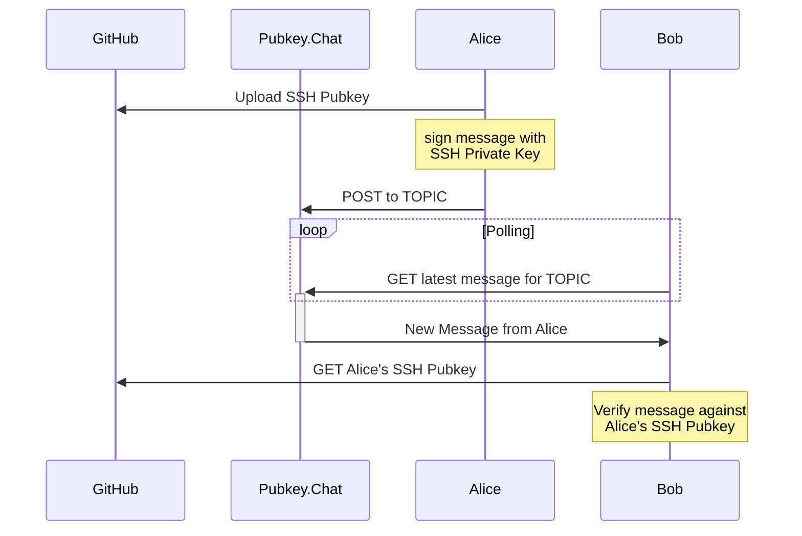

# Pubkey.Chat
*You're Already Logged In!*

[Pubkey.Chat](https://pubkey.chat) is an example of the
[WMAP](https://github.com/robertdfrench/wmap) protocol in action. It is
an IRC-like experience where all outgoing messages are signed with your
SSH key, and all incoming messages are verified against the author's
pubkeys. Every GitHub user's ssh pubkeys are [publicly
available](https://github.com/robertdfrench.keys).

## Architecture

### Sending and Receiving Messages
Every message is signed with your SSH private key, and then posted in a
public place. Your friends can verify these messages came from you by
checking the signature against your SSH public keys on GitHub. See
[WMAP](https://github.com/robertdfrench/wmap) for more information on
signing and verification.

For the sake of keeping the code simple and easy to auditable, the
client polls for new messages using repeated HTTP GET queries.
